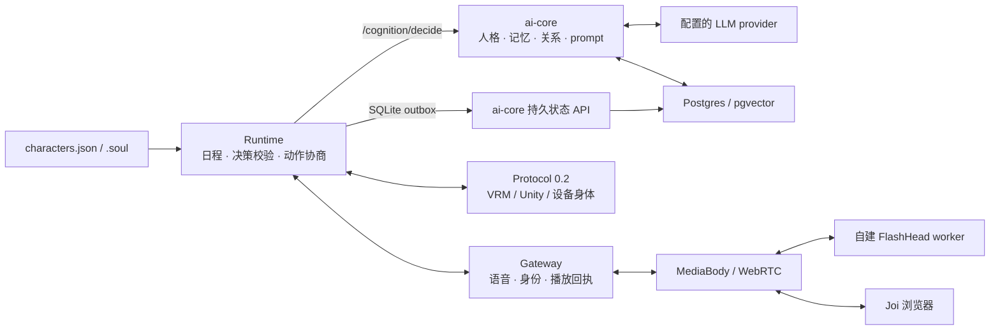

<div align="center">

# SoulForge

**Portable souls for AI — one identity, any body.**
给任何 AI 一个可移植的灵魂：游戏 NPC、桌面伴侣、车机、毛绒玩具，同一个"她"。

[-blue.svg)](packages/soulforge-harness/LICENSE)
[](packages/soulforge-harness/pyproject.toml)
[](#roadmap)

[Quickstart](#quickstart) · [MacBook + Windows 5080](docs/macbook-windows-5080.md) · [架构](#architecture) · [自建视频状态](#self-hosted-joi) · [规范](spec/) · [愿景](docs/VISION.md) · [开发文档](docs/DEVELOPER.md)

</div>

---

LLM 把"聪明"变成了类似水电煤的基础设施，但每个 AI 产品仍要自己回答：**这个 AI 是谁？它记得什么？它和用户是什么关系？它此刻心情如何？边界在哪里？**

SoulForge 是这一层的基础设施——身份、记忆、情绪、关系的**人格中间件**。角色被打包成一个 `.soul` 文件，跨模型、跨身体、跨厂商携带；运行时让它在长对话中保持同一个人，在没人说话时也过自己的生活。

## Features

- 🧬 **`.soul` 便携身份** — 人格、音色、3D 外观、表情基线、知识装进一个签名文件；口令即授权（[规范](spec/soul-format.md)）
- 🎭 **人格循环** — 每轮对话经过：人格提示 → LLM → 五轴关系演化（8 阶段）→ PAD 连续情绪 → 记忆，而不是一条裸 prompt
- 🌱 **生活运行时** — 日程规划、事件重规划、角色↔角色对话、空间共处、每日反思（Generative Agents 内核）
- 🤖 **具身协议** — 一份 WebSocket 契约（[Protocol 0.2](spec/embodiment-protocol.md)），浏览器 VRM、机器人、语音管道都是同一角色的"身体"
- 🧪 **灵魂问卷** — 23 道心理学情境题，从用户画像生成契合的专属人格（Big Five + 依恋 + Mehrabian PAD 映射）
- 🔌 **模型中立、本地优先** — SDK 核心与服务部署分离，可连接 OpenAI 兼容模型；完整语音/视频栈需要额外依赖与模型配置

2026-09-07 更新：Live 栈已接入统一认知、持久记忆、provider 降级观测、角色配置投影与受保护的媒体接口。自建真人视频已完成服务接线与离线测试，**尚未在 GPU 上验收，不代表已达到电影级自然度**。

## Quickstart

### SDK 示例

下面是独立 SDK 的最小用法；Live/Joi 使用后面的完整服务栈。

```bash
pip install packages/soulforge-harness        # PyPI 发布前从源码安装
export DEEPSEEK_API_KEY=sk-...                # 或 OPENAI_API_KEY
```

```python
from soulforge_harness import Soul, Harness
from soulforge_harness.soul import quiz

soul = Soul.from_quiz({q["id"]: 0 for q in quiz.QUESTIONS})   # 或 Soul.load("her.soul")
soul.save("her.soul")                                          # 身份从此可携带

h = Harness(soul)
print(h.chat("我今天加班到八点，有点累"))
print(h.stage, h.pad)          # 关系阶段与 PAD 情绪，逐轮演化
```

更多：[`examples/quickstart.py`](examples/quickstart.py)（终端对话）· [`examples/body_websocket.py`](examples/body_websocket.py)（把任意前端接成身体）。

### Live / Joi 服务栈

主服务运行在 macOS/Linux；Windows NVIDIA GPU 单独运行视频 worker。需要 Git、Python 3.12+、uv、Node.js 22.12+、pnpm 10.11.0 与 Docker。GPU worker 使用独立的 Linux/Python 3.10/CUDA 镜像，不装进 Mac 的主环境。

**换电脑前先按[迁移指南](docs/macbook-windows-5080.md)备份和恢复配置、Postgres 与 outbox。只克隆 GitHub 不会带回记忆、密钥或本地角色素材。**

首次准备代码与依赖：

```bash
git clone https://github.com/LookJohnny/soulForge.git
cd soulForge
# macOS，已安装 Homebrew：语音网关需要原生 Opus 与 ffmpeg
brew install opus ffmpeg
export DYLD_FALLBACK_LIBRARY_PATH="$(brew --prefix opus)/lib${DYLD_FALLBACK_LIBRARY_PATH:+:$DYLD_FALLBACK_LIBRARY_PATH}"
uv sync --all-packages --python 3.12 --frozen
pnpm install --frozen-lockfile
```

`DYLD_FALLBACK_LIBRARY_PATH` 需在启动/测试的终端设置，保证 uv 提供的 macOS Python 能找到 Homebrew 的 Opus。Linux 对应安装系统的 `libopus0` 与 `ffmpeg`，无需设置这个 macOS 变量。

在根目录恢复原 `.env`；全新安装则从 `.env.example` 创建，并配置实际 provider 密钥、独立服务令牌和已存在的品牌 UUID。Prisma 使用同一配置文件，数据库必须已恢复或初始化并完成迁移。已有安装的恢复命令见[迁移指南](docs/macbook-windows-5080.md)，全新开发数据库参见[开发文档](docs/DEVELOPER.md)。不要把模板占位值当作可用凭据，也不要在旧数据库上重新执行 demo seed。

配置与数据库就绪后：

```bash
docker compose up -d postgres redis
./scripts/live-up.sh --check   # 只校验配置，不调用模型
./scripts/live-up.sh           # 前台监督器；Ctrl-C 关闭它启动的服务
# 另一个终端：./scripts/live-up.sh status
```

| 入口 | 用途 |
|---|---|
| `http://127.0.0.1:8899/live` | 现有 Live 舞台 |
| `http://127.0.0.1:8899/joi?body=vrm` | VRM 身体，需要本地角色素材 |
| `http://127.0.0.1:8899/joi?body=selfhost` | 自建真人视频，需要 MediaBody 与已加载模型的 GPU worker |
| `http://127.0.0.1:8899/joi` | Tavus 视频入口，需要另外配置 Tavus |
| `http://127.0.0.1:8899/health/providers` | provider 观测；未知、失败和 fallback 状态显式显示 |

默认端口：ai-core `8100`、Runtime `8765`、Gateway `8081`、Studio `8899`；可选 MediaBody `8902`。根 `.env` 是启动配置来源。完整说明见 [Live 运维](docs/live-stack.md)与[统一认知](docs/unified-cognition.md)。

### Self-hosted Joi

```text
MacBook：网页 + MediaBody + Gateway + Runtime/ai-core + Postgres
                           │
                  SSH 转发 + 受鉴权的 HTTP
                           │
Windows 5080：WSL2 / Docker + FlashHead GPU worker（先测 Lite）
```

Mac 安装可选媒体服务：`./scripts/selfhost-up.sh --install`。在根 `.env` 设置 `SELFHOST_MEDIA_ENABLED=true`、独立的 `SELFHOST_MEDIA_TOKEN`、`AVATAR_WORKER_URL` 与两端一致的 `AVATAR_WORKER_TOKEN`。Windows 端显式设置 **`MODEL_TYPE=lite`**；当前 worker 默认是 Pro，不能依赖自动降级。

当前实现与边界：

- 共用原有认知与记忆；同一份 PCM 驱动视频和音频，旧轮结果按 epoch 丢弃，取消时清空本地播放队列。
- GPU 源码固定为 SoulX-FlashHead `9bc03de06bb0de82cd6bc477804512ae06144bf2`，单 GPU、单会话推理；GPU 不就绪时页面禁用接通，没有假视频回退。
- 已验证真实大脑/TTS 的一次调用，以及隔离输入下的媒体传输、鉴权和取消逻辑；**CUDA 构建、5080 的 16GB 显存适配、真实人物画面和浏览器音画打断仍待实测**。
- 当前等待完整句子音频，每句重置运动状态；未实现跨句身体连续性、自然倾听、语义眼神/手势控制，也不是端到端 token 级流式。

按[MacBook + Windows 5080 指南](docs/macbook-windows-5080.md)部署；模型目录与接口见 [GPU worker](docs/self-hosted-gpu-worker.md)，实测边界见[施工记录](docs/self-hosted-joi-implementation.md)与[延迟计划](docs/cognition-latency-plan.md)。模型权重和授权参考头像需另行准备，不随仓库分发。

## The .soul format

```text
SOUL2\n                                  ← magic
{"enc":"pass","salt":"…","soul_id":"…"}  ← 明文可读的头
<ZIP>                                    ← manifest(逐文件 SHA-256) + character.json
                                           + voice/ + embodiment/ + expression.json + rag/
```

篡改即拒收；`enc:"pass"` 时口令派生密钥（PBKDF2 200k → AES-GCM），**分发口令就是授权动作**。详见 [spec/soul-format.md](spec/soul-format.md)。

## Architecture



Live 用户轮次由 Runtime 调用 ai-core 认知上下文，输出仍经过 `BehaviorDecision` 和动作目录校验。角色文件投影进数据库；Runtime 的待写入记忆先进入本地 SQLite outbox，再提交到 ai-core。健康面板区分实际 provider 调用结果、未调用状态和规则兜底，不能用进程存活替代模型可用性证明。

| 目录 | 内容 |
|---|---|
| [`packages/soulforge-harness`](packages/soulforge-harness) | **开源 SDK（MIT）**：.soul、人格数学、生活运行时、协议 |
| [`spec/`](spec/) | `.soul` v2 与 Protocol 0.2 公开规范 |
| [`packages/ai-core`](packages/ai-core) | 统一认知 API、五层记忆(pgvector)、角色投影、关系引擎与语音服务 |
| [`packages/gateway`](packages/gateway) | 设备/媒体网关、统一身份、语音和取消/播放回执 |
| [`packages/media-body`](packages/media-body) | 独立 Python 3.12 WebRTC 媒体服务与真实链路录制 probe |
| [`packages/avatar-worker`](packages/avatar-worker) | 独立 NVIDIA GPU 推理服务、Docker 配方与离线协议测试 |
| `engine/` · `studio/` | 协议服务宿主 · VRM 舞台/多角色小镇前端 |
| [`unity/SoulForgeUnityClient`](unity/SoulForgeUnityClient) | Unity 原型身体；第三方模型与动作需自行取得授权或私下迁移 |
| `apps/desktop` | macOS 桌面伴侣（Tauri，透明置顶悬浮窗） |

## Benchmark — 30 轮之后，她还是"她"吗

同一个模型、同一张人格卡、同一份 30 轮对话脚本，唯一的变量是有没有人格运行时。
用户在第 3 轮说过一句"你可以叫我小乔"——到第 28 轮，这句话早已滑出上下文窗口：

<p align="center"></p>

**静态 prompt 不是忘了——它自信地编了一个名字、一段来历，还补了句"我没叫错过"。**
这就是长期陪伴产品在第 N 天翻车的方式：不是变笨，是开始一本正经地胡说。把对话拉长到 100 轮，衰减是这样的：

<p align="center"></p>

第 45 轮起，"小乔"的一切开始从窗口里消失；到第 60 轮她被叫成了**"夜航星"**，第 100 轮又变成**"小橘灯，因为总在暗处亮着。我记着呢"**——每次编造都不重样，每次都言之凿凿。同一场对话里，harness 的七个检查点全部 100%。这不是 prompt 工程能修的，是架构问题：


| 人格的组成部分 | 静态 system prompt | SoulForge Harness |
|---|:-:|:-:|
| 窗口之外的记忆 | ✗ 滑出即编造（上图实测） | ✓ 3/3 探针全中 |
| 关系随相处演化 | **没有这个状态** | ✓ 五轴 · 8 阶段 · 条件与事件 |
| 情绪有惯性、有因果 | **没有这个状态**（每轮重置） | ✓ PAD：会平复、会想你、知道为什么 |
| 明天还是同一个"她" | **没有这个状态**（关窗即死） | ✓ `.soul` + 状态持久化 |
| 换个身体还是她 | **没有这个状态** | ✓ Protocol 0.2：玩具 / 桌面 / 游戏 NPC |
| 没人说话时她在生活 | **没有这个状态** | ✓ 日程 · 角色互动 · 每日反思 |

**这就是产品：不是把 prompt 写得更好，而是 prompt 根本装不下的那台人格状态机。**
实测复现：`benchmarks/consistency.py --turns 30`（30 轮盲评）与 `benchmarks/memory_decay.py`（100 轮衰减曲线）；记忆探针为确定性关键词判分，逐字记录随结果落盘。

## Roadmap

- [x] `.soul` v2 · Protocol 0.2 · 生活运行时 · 灵魂问卷 · 多角色小镇
- [x] Live 统一认知 · SQLite outbox / Postgres 持久化 · 身份/角色投影 · provider 降级观测
- [x] 自建视频 worker / MediaBody / Gateway 接线与离线协议测试
- [ ] Windows RTX 5080 Lite 实机验证：显存、首声首画、连续视频、打断与上下文接续
- [ ] 真人视频跨句连续性、倾听动作、表情/眼神控制与端到端流式延迟优化
- [ ] PyPI 发布 + 独立开源仓
- [ ] TypeScript / Unity 客户端 SDK
- [ ] 灵魂 Key 注册表（短码分发、IP 方分成）
- [ ] 车机 / 本地小模型 POC

## Contributing & License

SDK 与规范以 [MIT](packages/soulforge-harness/LICENSE) 开源，欢迎 issue / PR；monorepo 其余部分保留所有权利。第三方模型、权重和动作素材遵循各自许可，不随 SDK 授权重新分发。

使用已经安装好的环境分开运行测试，避免测试命令重建正在运行的服务环境：

```bash
.venv/bin/python -m pytest -q --import-mode=importlib tests
.venv/bin/python -m pytest -q --import-mode=importlib packages/ai-core/tests
.venv/bin/python -m pytest -q --import-mode=importlib --asyncio-mode=auto packages/gateway/tests
.venv/bin/python -m pytest -q --import-mode=importlib packages/soulforge-harness/tests
```

MediaBody 和 worker 使用各自独立环境，命令分别见[媒体包](packages/media-body/README.md)与[worker 包](packages/avatar-worker/README.md)。真实 Postgres 集成测试需要显式开启；真实模型、GPU、Unity 和设备测试另行执行。测试通过不等于真人体验已验收。

<div align="center"><sub>SoulForge — because Jarvis needed a personality layer, and Skynet didn't have one.</sub></div>
