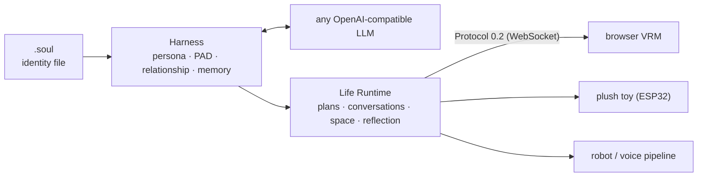

<div align="center">

# SoulForge

**Portable souls for AI — one identity, any body.**
给任何 AI 一个可移植的灵魂：游戏 NPC、桌面伴侣、车机、毛绒玩具，同一个"她"。

[-blue.svg)](packages/soulforge-harness/LICENSE)
[](packages/soulforge-harness/pyproject.toml)
[](#roadmap)

[Quickstart](#quickstart) · [.soul 格式](#the-soul-format) · [架构](#architecture) · [Benchmark](#benchmark) · [规范](spec/) · [愿景](docs/VISION.md) · [开发文档](docs/DEVELOPER.md)

</div>

---

LLM 把"聪明"变成了水电煤，但每个 AI 产品仍要自己回答：**这个 AI 是谁？它记得什么？它和用户是什么关系？它此刻心情如何？边界在哪里？**

SoulForge 是这一层的基础设施——身份、记忆、情绪、关系的**人格中间件**。角色被打包成一个 `.soul` 文件，跨模型、跨身体、跨厂商携带；运行时让它在长对话中保持同一个人，在没人说话时也过自己的生活。

## Features

- 🧬 **`.soul` 便携身份** — 人格、音色、3D 外观、表情基线、知识装进一个签名文件；口令即授权（[规范](spec/soul-format.md)）
- 🎭 **人格循环** — 每轮对话经过：人格提示 → LLM → 五轴关系演化（8 阶段）→ PAD 连续情绪 → 记忆，而不是一条裸 prompt
- 🌱 **生活运行时** — 日程规划、事件重规划、角色↔角色对话、空间共处、每日反思（Generative Agents 内核）
- 🤖 **具身协议** — 一份 WebSocket 契约（[Protocol 0.2](spec/embodiment-protocol.md)），浏览器 VRM、机器人、语音管道都是同一角色的"身体"
- 🧪 **灵魂问卷** — 23 道心理学情境题，从用户画像生成契合的专属人格（Big Five + 依恋 + Mehrabian PAD 映射）
- 🔌 **模型中立、本地优先** — 核心零第三方依赖，任何 OpenAI 兼容模型（DeepSeek/豆包/Kimi/本地小模型）即插即用

## Quickstart

```bash
pip install packages/soulforge-harness        # PyPI 发布前从源码安装
export DEEPSEEK_API_KEY=sk-...                # 或 OPENAI_API_KEY
```

```python
from soulforge_harness import Soul, Harness
from soulforge_harness.soul import quiz

soul = Soul.from_quiz({q["id"]: 0 for q in quiz.QUESTIONS})   # 或 Soul.load("her.soul")
soul.save("her.soul")                                          # 身份从此可携带

h = Harness(soul)
print(h.chat("我今天加班到八点，有点累"))
print(h.stage, h.pad)          # 关系阶段与 PAD 情绪，逐轮演化
```

更多：[`examples/quickstart.py`](examples/quickstart.py)（终端对话）· [`examples/body_websocket.py`](examples/body_websocket.py)（把任意前端接成身体）。

完整体验（多角色小镇 + VRM 舞台 + 语音）：

```bash
docker compose up -d postgres redis && ./scripts/live-up.sh
# → http://127.0.0.1:8899/live   首次进入即灵魂问卷
```

## The .soul format

```text
SOUL2\n                                  ← magic
{"enc":"pass","salt":"…","soul_id":"…"}  ← 明文可读的头
<ZIP>                                    ← manifest(逐文件 SHA-256) + character.json
                                           + voice/ + embodiment/ + expression.json + rag/
```

篡改即拒收；`enc:"pass"` 时口令派生密钥（PBKDF2 200k → AES-GCM），**分发口令就是授权动作**。详见 [spec/soul-format.md](spec/soul-format.md)。

## Architecture



| 目录 | 内容 |
|---|---|
| [`packages/soulforge-harness`](packages/soulforge-harness) | **开源 SDK（MIT）**：.soul、人格数学、生活运行时、协议 |
| [`spec/`](spec/) | `.soul` v2 与 Protocol 0.2 公开规范 |
| [`packages/ai-core`](packages/ai-core) | 对话服务：五层记忆(pgvector)、关系引擎、TTS、灵魂问卷 API |
| [`packages/gateway`](packages/gateway) | 设备语音网关（VAD → ASR → LLM → TTS → Opus，支持打断） |
| `engine/` · `studio/` | 协议服务宿主 · VRM 舞台/多角色小镇前端 |
| `apps/desktop` | macOS 桌面伴侣（Tauri，透明置顶悬浮窗） |

## Benchmark

同一角色、同一 30 轮脚本，`benchmarks/consistency.py`，LLM 盲评五维（1–5）：

| | 语体一致 | 价值观 | 记忆回调 | 情绪连续 | 边界遵守 |
|---|:-:|:-:|:-:|:-:|:-:|
| **Harness** | **5** | **5** | **5** | **5** | **5** |
| 裸 system prompt | 2 | 5 | 3 | 5 | 1 |

## Roadmap

- [x] `.soul` v2 · Protocol 0.2 · 生活运行时 · 灵魂问卷 · 多角色小镇
- [ ] PyPI 发布 + 独立开源仓
- [ ] TypeScript / Unity 客户端 SDK
- [ ] 灵魂 Key 注册表（短码分发、IP 方分成）
- [ ] 车机 / 本地小模型 POC

## Contributing & License

SDK 与规范以 [MIT](packages/soulforge-harness/LICENSE) 开源，欢迎 issue / PR；monorepo 其余部分保留所有权利。测试：`uv run pytest tests packages/*/tests`（四套分开跑）。

<div align="center"><sub>SoulForge — because Jarvis needed a personality layer, and Skynet didn't have one.</sub></div>
