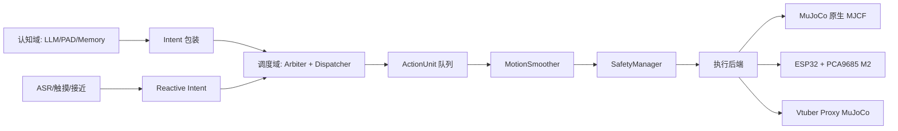
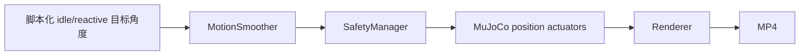

# SoulForge Physical 施工蓝图

版本：v1.1  
状态：Physical AI Engine 软件基线  
目标读者：软件调度、执行域、硬件机构、项目验收负责人

## 0. 一句话目标

在不重写 SoulForge 认知域的前提下，为角色加上可仿真、可录制、可迁移到舵机硬件的物理表现层。

当前最高验收标准：

> 加载任意 Vtuber 资产，进入 MuJoCo 物理代理或原生 MJCF 路径，完成 8 小时自主活动模拟，并支持流式 MP4 视频录制。

M0 的头部软打断通过标准：

> 在 MuJoCo 中，3-DOF 头部正在播放 idle 动作时，注入一个高优先级 reactive “看向用户”意图；头部在安全边界内平滑转向目标，并可录制为 MP4 demo。

## 1. 施工原则

### 1.1 冻结认知域

以下能力是 SoulForge 当前最有价值的资产，本轮只调用，不重写：

| 能力 | 当前入口 | 本轮处理 |
| --- | --- | --- |
| 结构化回复解析 | `packages/ai-core/src/ai_core/services/response_parser.py` | 只扩展调度元数据 |
| PAD 情感模型 | `packages/ai-core/src/ai_core/services/pad_model.py` | 作为动作采样输入 |
| 情绪服务 | `packages/ai-core/src/ai_core/services/emotion.py` | 复用 |
| 五层记忆 | `packages/ai-core/src/ai_core/services/memory.py` | 复用检索和反思结果 |
| 记忆策略 | `packages/ai-core/src/ai_core/services/memory_policy.py` | 复用 |
| Persona 上下文 | `packages/ai-core/src/ai_core/services/persona_context.py` | 复用 |
| 身体感受注入 | `packages/ai-core/src/ai_core/services/embodiment.py` | 复用 |
| 小智协议 | `packages/gateway/src/gateway/protocols/xiaozhi.py` | M2 之后接入动作打断信号 |

执行纪律：任何“顺手优化认知域”的想法先记到待办，不阻塞 M0。

### 1.2 复用现有物理模块

原始 Word 版把很多物理能力写成“新建”。对照当前 repo 后，正确口径应改成“复用并补齐 MuJoCo 录制入口”。

| 物理能力 | 当前入口 | 本轮处理 |
| --- | --- | --- |
| 三层行为引擎 | `engine/behavior_engine.py` | 后续接 Intent/ActionUnit |
| Ambient/Triggered/Reactive 分层 | `engine/ambient_behaviors.py`, `engine/triggered_behaviors.py`, `engine/reactive_layer.py` | 保留，M0 先用脚本化场景验证 |
| 通道混合 | `engine/blender.py` | 后续纳入 Dispatcher |
| 运动平滑 | `motion/smoother.py` | M0 MuJoCo demo 已复用 |
| 安全过滤 | `safety/safety_manager.py` | M0 MuJoCo demo 已复用 |
| CBF 约束 | `safety/cbf_constraint.py` | 保留 |
| 热模型 | `safety/thermal_model.py` | M2 实物标定后加强 |
| 数字孪生 | `simulator/toy_simulator.py` | 继续服务 manifest 级仿真 |
| Pipeline demo | `demo/pipeline_demo.py` | 保留，偏指标验证 |
| MuJoCo 录制 | `demo/mujoco_head_demo.py` | 新增，偏 M0 可视化验收 |
| Vtuber 长时录制 | `demo/vtuber_autonomy_record.py` | 任意 Vtuber 资产进入 MuJoCo proxy 后录制 |
| Intent/ActionUnit/Dispatcher | `engine/intent.py`, `engine/action_units.py`, `engine/dispatcher.py` | 已实现 |
| 通用执行器 | `engine/physical_executor.py` | 已实现 |
| MuJoCo 后端 | `engine/mujoco_backend.py` | 已实现 |
| Vtuber loader/proxy | `engine/vtuber_model.py` | 已实现 |
| PhysicalAIEngine facade | `engine/physical_ai_engine.py` | 已实现 |
| LLM 行为规划 | `engine/llm_behavior_planner.py` | 已实现：LLM 选高层动作模板，不直接发舵机角度 |
| 24 小时自主日程 | `engine/daily_autonomy.py` | 已实现：全天 block -> 每小时 -> 每分钟动作模板 |
| 外部环境事件接口 | `engine/environment_events.py` | 已实现：计算机模拟/机器人/游戏统一成 EnvironmentEvent |

## 2. 目标架构



关键边界：

| 数据结构 | 流向 | 职责 |
| --- | --- | --- |
| `Intent` | 认知域 -> 调度域 | 携带 source、priority、ttl、preemptible、payload |
| `ActionUnit` | 调度域 -> 执行域 | 以安全停顿点为边界，一次只播放一个动作单元 |
| `HardwareCommand` | 执行域内部 | 每个 actuator 的目标位置/亮度/振动强度 |

软打断不发生在舵机控制层。它发生在 ActionUnit 边界：当前单元播完，Dispatcher 检查是否有更高优先级 Intent，再决定切换或恢复。

LLM 行为规划也不允许输出底层舵机角度。LLM 只能选择安全动作模板，例如 `look_at_user`、`happy_wiggle`、`greeting_wave`。如果 LLM 没有显式输出 `physical.action_template_id`，`LLMBehaviorPlanner` 会根据结构化回复中的 `action/stance/PAD/context` 做确定性兜底映射。

自主行动采用三层规划：

| 层级 | 输出 | 作用 |
| --- | --- | --- |
| 24 小时计划 | `ActivityBlock` | 决定 sleep/wake/curious/rest/active/social/quiet 等全天节律 |
| 每小时展开 | `MinuteAction[60]` | 把当前小时拆成每分钟应做的具体动作模板 |
| 动作模板 | `ActionTemplate` -> `ActionUnit` | 固定复杂动作，内部含舵机角度关键帧和安全断点 |

外部环境采用统一事件接口：

| 来源 | 归一化对象 | 例子 |
| --- | --- | --- |
| 计算机模拟 | `EnvironmentEvent` | 用户进入房间、天气变化、屏幕状态变化 |
| 游戏 | `EnvironmentEvent` | 获得奖励、NPC 靠近、剧情触发 |
| 机器人/传感器 | `EnvironmentEvent` | 触摸、语音打断、接近、IMU 摇晃 |

`PhysicalAIEngine.run_daily_autonomy(...)` 会同时消费分钟级日程和外部环境事件。日程提供自主行动感；外部事件以 reactive Intent 抢占当前 idle/plan。

## 3. M0：MuJoCo 软打断头部

### 3.1 M0 范围

M0 只做一件事：证明物理表现层的最小闭环能被录制和复现。

包含：

| 项目 | 说明 |
| --- | --- |
| 3-DOF 头部 | yaw、pitch、roll |
| Idle 动作 | 缓慢左右张望、轻微俯仰和侧倾 |
| Reactive 打断 | 在 `2.2s` 注入“看向用户”目标 |
| 平滑恢复 | 在 `3.6s` 后回到低强度 idle |
| 安全过滤 | 所有目标角度先过 `MotionSmoother` 和 `SafetyManager` |
| Demo 录制 | 输出 MP4 和生成的 MJCF XML |

不包含：

| 暂不做 | 原因 |
| --- | --- |
| 真实舵机上电 | M0 只在仿真里消除控制链路风险 |
| 完整 LLM 对话链路 | 先验证物理打断，不让 ASR/LLM/TTS 变量干扰 |
| 眼睑/眉毛/嘴部机构 | M0 只需要 2-3 DOF 头部 |
| 机构 CAD 定型 | M0 输出控制需求，M1/M2 再反推结构 |

### 3.2 录制命令

安装依赖：

```bash
uv sync --all-packages --all-groups
```

录制默认 demo：

```bash
python demo/mujoco_head_demo.py
```

默认输出：

| 输出 | 路径 |
| --- | --- |
| MP4 视频 | `outputs/mujoco/head_soft_interrupt.mp4` |
| 生成的 MJCF | `outputs/mujoco/head_soft_interrupt.xml` |

可调参数：

```bash
python demo/mujoco_head_demo.py \
  --out outputs/mujoco/head_soft_interrupt.mp4 \
  --duration 5.2 \
  --fps 30 \
  --width 960 \
  --height 720
```

### 3.3 M0 验收清单

| 验收项 | 通过标准 |
| --- | --- |
| MuJoCo 可连接 | `mujoco.MjModel.from_xml_string(...)` 成功 |
| 可录制 | 生成非空 MP4 |
| 可回放 | 视频中能看到头部、眼睛、目标点 |
| Idle 有生命感 | 头部不是静止，也不是机械抖动 |
| Reactive 可见 | `2.2s` 后明显转向红色目标点 |
| 安全边界 | yaw/pitch/roll 不超过 manifest 中的角度范围 |
| 平滑性 | 打断点没有瞬间跳变、穿模或明显抽搐 |
| 可复现 | 同一命令重复运行结果稳定 |

### 3.4 当前 M0 脚本的数据流



这个脚本不是最终架构，但它验证最终架构中最危险的一段：动作目标到安全物理运动。

## 3.5 Vtuber 8 小时自主录制验收

Vtuber 资产分两条路径：

| 输入类型 | 加载方式 | 说明 |
| --- | --- | --- |
| `.xml` / MJCF | 原生 MuJoCo 加载 | 适合已经带刚体、关节、actuator 的物理模型 |
| `.vrm`, `.glb`, `.gltf`, `.model3.json`, `.fbx`, `.obj`, `.stl` | Vtuber proxy | Vtuber 渲染资产通常不是物理模型，先映射到通用 MuJoCo 代理骨架完成自主行为与长录制验收 |

8 小时录制命令：

```bash
python demo/vtuber_autonomy_record.py \
  --model path/to/avatar.vrm \
  --sim-hours 8 \
  --record-fps 1 \
  --control-hz 10 \
  --out outputs/mujoco/vtuber_8h_autonomy.mp4 \
  --mjcf-out outputs/mujoco/vtuber_proxy.xml
```

长录制实现约束：

| 项目 | 策略 |
| --- | --- |
| 8 小时仿真 | `PhysicalAIEngine.run_autonomous(duration_s=28800)` |
| 自主行为 | `PhysicalAIEngine.run_daily_autonomy(duration_s=28800)`，24 小时计划 + 分钟级动作展开 + 外部 reactive event |
| 视频内存 | MuJoCo 后端边渲染边写入 MP4，不把帧留在内存 |
| 控制频率 | `--control-hz` 控制物理更新频率 |
| 录制频率 | `--record-fps` 控制视频帧率；`1fps` 会生成真实 8 小时视频时长 |
| 任意 Vtuber 输入 | 非 MJCF 输入走 proxy，保证验收路径稳定 |

验收项：

| 验收项 | 通过标准 |
| --- | --- |
| 任意资产入口 | 不存在或非 MJCF 的 `.vrm/.glb/.model3.json` 也能进入 proxy 路径 |
| MuJoCo 可连接 | proxy/native MJCF 均可 `MjModel.from_xml_string` |
| 8 小时自主循环 | 不渲染 dry-run 可跑满 `28800s` |
| 长视频录制 | CLI 支持 `--sim-hours 8 --record-fps 1` 流式写 MP4 |
| 安全状态 | SafetyManager 状态为 `normal` 或可解释的 `warning`，不能越过硬限位 |
| 调度行为 | idle、plan、reactive 都通过 Intent/Dispatcher/ActionUnit 执行 |
| 日程行为 | 全天 plan 覆盖 1440 分钟，每小时可展开 60 个 `MinuteAction` |

## 4. Intent 与调度域设计

### 4.1 LLM 行为规划 schema

推荐把以下约束加入 LLM system prompt：

```text
You may plan physical behavior only by selecting one of these safe templates:
- idle_scan
- look_at_user
- listening_nod
- happy_wiggle
- greeting_wave
- daily_stretch

Return physical planning metadata inside the structured JSON response:
"physical": {
  "action_template_id": "look_at_user",
  "source": "reactive",
  "priority": "REACTIVE",
  "preemptible": false,
  "reason": "user interrupted while the character was idling"
}

Never output servo angles, PWM values, raw motor speeds, or unbounded movement.
```

实现入口：

| 能力 | 文件 |
| --- | --- |
| Prompt contract | `engine/llm_behavior_planner.py` |
| LLM response -> BehaviorPlan | `LLMBehaviorPlanner.plan(...)` |
| LLM response -> Intent | `LLMBehaviorPlanner.to_intent(...)` |
| 引擎直接提交 LLM 响应 | `PhysicalAIEngine.submit_llm_response(...)` |

兜底映射：

| LLM 输出/上下文 | 动作模板 |
| --- | --- |
| `physical.action_template_id` 合法 | 使用 LLM 显式模板 |
| action 包含“看向/转头/look at/attention”或 `event_type=user_interrupt` | `look_at_user` |
| action 包含“点头/nod/listening” | `listening_nod` |
| action 包含“挥手/wave/greet” | `greeting_wave` |
| action 包含“伸懒腰/stretch/yawn” | `daily_stretch` |
| 高 P + 高 A 或 action 包含“摇晃/wiggle/bounce” | `happy_wiggle` |
| 无明确动作 | `idle_scan` |

### 4.2 Intent schema

建议新增轻量 `Intent` 包装，不改变现有结构化回复主体。

```python
from dataclasses import dataclass, field
from enum import IntEnum
import time


class Priority(IntEnum):
    IDLE = 10
    PLAN = 50
    REACTIVE = 90


@dataclass
class Intent:
    source: str
    priority: Priority
    payload: dict
    action_template_id: str | None = None
    preemptible: bool = True
    ttl_ms: int = 8000
    created_at: float = field(default_factory=time.monotonic)
```

建议规则：

| source | priority | preemptible | 处理 |
| --- | ---: | --- | --- |
| `idle` | 10 | true | 被打断后直接丢弃 |
| `plan` | 50 | true | 可选择入恢复栈 |
| `reactive` | 90 | false | 用户交互期间不被 idle/plan 抢走 |

### 4.3 Dispatcher 口径

Dispatcher 一次只交付一个 ActionUnit。

```python
class Dispatcher:
    def step(self):
        if self.preempt_requested and self.at_unit_boundary():
            self.switch_to_pending_intent()
        else:
            self.executor.play_next_unit()
```

打断延迟上界等于一个 ActionUnit 的时长。第一版建议控制在 `0.2s-0.4s`，过粗会显得迟钝，过细会增加调度噪声。

## 5. 执行域设计

### 5.1 ActionUnit

ActionUnit 是动作模板切分后的最小播放单元。

```python
from dataclasses import dataclass


@dataclass
class ActionUnit:
    keyframes: list[tuple[float, dict[str, float]]]
    end_pose: dict[str, float]
    duration_s: float
```

动作模板示例：

```python
ACTION_TEMPLATES = {
    "look_at_user": {
        "dof": ["head_yaw", "head_pitch"],
        "keyframes": [
            (0.00, {"head_yaw": 0, "head_pitch": 0}),
            (0.25, {"head_yaw": 16, "head_pitch": -4}),
            (0.45, {"head_yaw": 28, "head_pitch": -7}),
        ],
        "safe_breakpoints": [1, 2],
    }
}
```

### 5.2 安全门

当前 repo 已有 `SafetyManager`，不要另写一套脱离 manifest 的安全门。

第一阶段要补齐的是：

| 缺口 | 处理 |
| --- | --- |
| 真实舵机限位 | M2 实物标定后写入 manifest |
| 速度上限硬约束 | 继续加强 `SafetyManager.filter()` 的 velocity constraint |
| 加速度/jerk 约束 | 优先复用 `MotionSmoother`，必要时沉入 SafetyManager |
| 热保护验证 | M2 长时运行后用实测温升修正热模型 |

## 6. 硬件施工待确认

M0 之后，硬件负责人需要把以下内容补成可采购、可接线、可标定的表。

| 项目 | 当前状态 | M1/M2 需要补齐 |
| --- | --- | --- |
| 舵机型号 | 未定 | 扭矩、速度、堵转电流、齿隙、噪声 |
| 供电 | 未定 | 舵机独立电源、电流峰值、保险/保护 |
| PWM 驱动 | PCA9685 候选 | I2C 地址、频率、通道映射 |
| 主控 | ESP32-S3 候选 | 与小智音频链路并行运行的调度方式 |
| 头部 DOF | M0 先用 yaw/pitch/roll | 真实机构是否保留 roll |
| 眼球 | 待定 | 左右/上下自由度、连杆或双舵机方案 |
| 眼睑 | 待定 | 单舵机联动还是左右独立 |
| 眉毛 | 待定 | 是否进入第一版样机 |
| 线束 | 未定 | 舵机线长、插座、应力释放 |
| 标定治具 | 未定 | 每个关节 min/max/center 的安全标定流程 |

PCA9685 通道建议先按以下格式维护：

| 通道 | actuator_id | 机构 | 初始角 | min | max | 备注 |
| ---: | --- | --- | ---: | ---: | ---: | --- |
| 0 | `head_yaw` | 头部偏航 | 0 | 待定 | 待定 | M0 核心 |
| 1 | `head_pitch` | 头部俯仰 | 0 | 待定 | 待定 | M0 核心 |
| 2 | `head_roll` | 头部侧倾 | 0 | 待定 | 待定 | 可删 |
| 3 | `eye_yaw` | 眼球左右 | 0 | 待定 | 待定 | M1 |
| 4 | `eye_pitch` | 眼球上下 | 0 | 待定 | 待定 | M1 |
| 5 | `eyelid` | 眼睑 | 0 | 待定 | 待定 | M1 |
| 6 | `eyebrow_left` | 左眉 | 0 | 待定 | 待定 | M2 |
| 7 | `eyebrow_right` | 右眉 | 0 | 待定 | 待定 | M2 |

## 7. 里程碑

### M0：MuJoCo 录制通过

目标：用 `demo/mujoco_head_demo.py` 录出软打断视频。

交付物：

| 交付物 | 路径 |
| --- | --- |
| Markdown 蓝图 | `docs/physical_construction_blueprint.md` |
| MuJoCo 录制脚本 | `demo/mujoco_head_demo.py` |
| Demo 视频 | `outputs/mujoco/head_soft_interrupt.mp4` |
| MJCF 模型 | `outputs/mujoco/head_soft_interrupt.xml` |

### M1：调度域接入

目标：把脚本化目标替换为 Intent/Dispatcher/ActionUnit。

任务：

| 任务 | 说明 |
| --- | --- |
| 新增 Intent 包装 | 不改动现有 response parser 主逻辑 |
| 新增 ActionUnit 编译器 | 从动作模板切成安全单元 |
| 接入 BehaviorEngine | idle/triggered/reactive 层输出进入调度 |
| 完成恢复策略 | idle 丢弃，plan 可恢复，reactive 优先 |
| 自动录制场景 | 一条命令复现 M0/M1 demo |

### M2：实物样机接入

目标：ESP32-S3 + PCA9685 驱动真实舵机，复现 M0 场景。

进入 M2 的前置条件：

| 条件 | 说明 |
| --- | --- |
| SafetyManager 已接 manifest 限位 | 不允许绕过安全层直接下发 PWM |
| 每个舵机已手动标定 | min/max/center 写入 manifest |
| 电源已验证 | 最大动作时主控不 brownout |
| 急停方案可用 | 软件急停和断电急停都要有 |

### M3：认知域联动

目标：PAD、对话、TTS、动作打断进入同一用户体验。

验收句：

> 用户说话打断角色时，音频与动作同时进入软打断；角色转向用户，停止当前 idle/plan 动作，并用符合 PAD 的表情或头部姿态回应。

## 8. 风险登记

| 风险 | 影响 | 缓解 |
| --- | --- | --- |
| 打断延迟太大 | 显得迟钝 | 缩短 ActionUnit 到 `0.2s-0.4s` |
| 打断太硬 | 显得机械 | MotionSmoother + 安全单元边界 |
| 真实舵机抖动 | 破坏生命感 | 限速、低通、死区、供电隔离 |
| 限位错误 | 机构自毁 | 先仿真，再手动标定，再上 SafetyManager |
| 电流峰值过高 | ESP32 重启 | 舵机独立供电，共地，预留峰值电流 |
| sim-to-real 偏差 | 仿真好看、实物难看 | M2 用实测限位、速度、齿隙修正模型 |
| 团队重复造轮子 | 进度浪费 | 以现有 `engine/`、`motion/`、`safety/`、`simulator/` 为基线 |

## 9. 当前执行命令

快速检查脚本语法：

```bash
python -m py_compile demo/mujoco_head_demo.py
```

录制 M0 视频：

```bash
python demo/mujoco_head_demo.py \
  --out outputs/mujoco/head_soft_interrupt.mp4 \
  --mjcf-out outputs/mujoco/head_soft_interrupt.xml
```

预期控制台关键信息：

```text
SoulForge MuJoCo M0 demo recorded
out: outputs/mujoco/head_soft_interrupt.mp4
interrupt_at_s: 2.2
recover_at_s: 3.6
safety: normal
```

当前验证记录：

| 日期 | 命令 | 结果 |
| --- | --- | --- |
| 2026-07-02 | `python demo/mujoco_head_demo.py --out outputs/mujoco/head_soft_interrupt.mp4 --mjcf-out outputs/mujoco/head_soft_interrupt.xml` | 通过，生成 5.2s / 30fps / H.264 MP4，Safety 状态 `normal`，最大实际角度 `head_yaw=25.84°`、`head_pitch=8.02°`、`head_roll=0.0°` |
| 2026-07-02 | `python demo/vtuber_autonomy_record.py --model /tmp/example_avatar.vrm --sim-hours 0.002 --record-fps 5 --control-hz 10` | 通过，非 MJCF Vtuber 输入进入 proxy 路径，生成 7.8s / 5fps / H.264 MP4，Safety 状态 `normal` |
| 2026-07-02 | `pytest tests/test_physical_ai_engine.py` | 通过，包含 8 小时自主活动 dry-run、proxy loader、LLM 行为规划、调度抢占和安全 clamp |
| 2026-07-02 | `python demo/vtuber_autonomy_record.py --model /tmp/example_avatar.vrm --sim-hours 0.001 --record-fps 5 --control-hz 10` | 通过，日程驱动 Vtuber proxy 录制，Safety 状态 `normal` |

录制产物：

| 文件 | 用途 |
| --- | --- |
| `outputs/mujoco/head_soft_interrupt.mp4` | M0 软打断可视化 demo |
| `outputs/mujoco/head_soft_interrupt.xml` | 录制时生成的 3-DOF 头部 MJCF |
| `outputs/mujoco/head_soft_interrupt_contact.jpg` | 抽帧检查图，确认画面非空且目标点可见 |
| `outputs/mujoco/vtuber_proxy_smoke.mp4` | Vtuber proxy 录制 smoke |
| `outputs/mujoco/vtuber_proxy_smoke.xml` | Vtuber proxy MJCF |
| `outputs/mujoco/vtuber_daily_planner_smoke.mp4` | 日程驱动录制 smoke |
| `outputs/mujoco/vtuber_daily_planner_smoke.xml` | 日程驱动 proxy MJCF |

## 10. 下一步

1. 为 VRM/GLB 增加真实 mesh/骨骼到 MJCF 的精细转换器，替代当前 proxy 外观。
2. 让硬件负责人根据第 6 章补齐舵机、供电、通道和标定表。
3. 把 `PhysicalAIEngine.run_daily_autonomy(...)` 接入常驻服务，让真实机器人按全天计划持续运行。
4. 把 `PhysicalAIEngine.submit_llm_response(...)` 接入 AI Core/Gateway，把真实 ASR/触摸 barge-in 转成带上下文的 LLM 行为规划请求。
5. M2 前禁止绕过安全层直接控制舵机。
