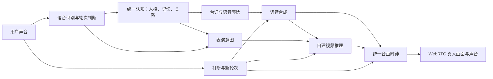

# 自建 Joi 真人视频服务：可行性与首轮验证

日期：2026-09-07。状态：代码与官方资料核查完成；尚未运行候选 GPU 模型或租用算力。
用户方向：真人视频脸、自然对话，效果优先，可考虑独立 NVIDIA GPU 或云 GPU。

## 判断

可以自建。现有统一认知、身份和持久记忆可以保留；需要自主掌握视频推理、
表演控制、语音交付、音画时钟和取消。采用已发布的模型权重作为视觉基础，
服务与交互由 SoulForge 实现，是当前可验证的路线。

自建提供更大的控制空间，不自动保证比 Tavus 自然。真人感还取决于角色资产、
声音、语义与表情是否一致、听人说话时的反应，以及停止和接续是否顺畅。
不能用一段漂亮样片或高生成 FPS 替代真实对话验收。

现测开发机是 Apple M4 / 16 GiB 内存；它继续承担开发与控制，候选 CUDA 视频模型
以独立 GPU 为评估环境。自建视频也不要求同时把 LLM、ASR、TTS 全迁到本地。

## 候选与证据

下表都是作者公布的配置与结果，不是 SoulForge 实测，也不是端到端首响应延迟。

| 候选 | 合适用途 | 作者报告 | 当前边界 |
| --- | --- | --- | --- |
| SoulX-FlashHead Pro | 真人头部近景的质量基线 | 单 RTX 4090 为 10.8 FPS；双 RTX 5090 可达 25+ FPS | 强项是脸/头；不能据此承诺精确眼神、听众反应、手势或全身动作 |
| SoulX-FlashHead Lite | 较轻的速度对照 | 单 RTX 4090 为 96 FPS | 快速版本不等于最高画质；须测语音分块、首帧和表情真实性 |
| SoulX-LiveAct | 动作/情绪可编辑的视频对照 | 双 H100/H200 在 720×416 或 512×512 达 20 FPS；单 RTX 5090 offload 为 6 FPS | 提供编辑示例，在线精细控制与抢话仍需自行接入；代码整体授权待明确 |
| MetaHuman + 音频面部驱动 | 长期全身、空间与细致动作控制 | 本次不采用未经验证的整体帧率 | 写实 3D 渲染，观感依赖资产、灯光、表演；并非音频生成真人视频 |

来源：[FlashHead 官方代码](https://github.com/Soul-AILab/SoulX-FlashHead)、
[FlashHead 论文](https://arxiv.org/abs/2602.07449)、
[LiveAct 官方代码](https://github.com/Soul-AILab/SoulX-LiveAct)、
[NVIDIA Audio2Face-3D](https://github.com/NVIDIA/Audio2Face-3D)。

FlashHead 的代码与官方权重均标 Apache-2.0，依赖仍须分别核对。
LiveAct 的官方权重标 Apache-2.0，但公开推理代码仓库没有明确的整体 LICENSE；
不能把“代码公开”写成“整套商用授权清楚”。
[FlashHead 权重](https://huggingface.co/Soul-AILab/SoulX-FlashHead-1_3B)、
[LiveAct 权重](https://huggingface.co/Soul-AILab/LiveAct)。

暂不将 LiveAvatar 当首选部署：其官方实时路径依赖多卡；将模型装进一张卡与
达到实时交互是两个判断。MuseTalk 可作为对嘴组件，但单靠嘴部重绘无法补齐
我们最关心的倾听、眼神和语义动作。
[LiveAvatar](https://github.com/Alibaba-Quark/LiveAvatar)、
[MuseTalk](https://github.com/TMElyralab/MuseTalk)。

## 源码核查发现

- FlashHead 官方 `gradio_app_streaming.py` 先用 librosa 读取完整音频，
  再分块推理；演示每 3 个模型块打包一段 MP4 交给前端。
  不能把这个 Gradio 界面直接当作低延迟语音通话服务器。
- FlashHead 论文描述约 1.32 秒音频片段和音频上下文缓存。
  生成吞吐高并不消除输入缓冲、首块推理、编码及网络延迟；更小块不能随意裁短。
- LiveAct 的 `example_edit.json` 确实展示了表情和动作文本编辑。
  其 GUI `demo.py` 同样读取音频文件、预处理编辑提示，再生成流式视频输出。
  这证明有控制入口，不证明已有与用户实时插话联动的服务。

直接来源：[FlashHead 演示源码](https://github.com/Soul-AILab/SoulX-FlashHead/blob/main/gradio_app_streaming.py)、
[LiveAct 编辑示例](https://github.com/Soul-AILab/SoulX-LiveAct/blob/main/examples/example_edit.json)、
[LiveAct 演示源码](https://github.com/Soul-AILab/SoulX-LiveAct/blob/main/demo.py)。

## SoulForge 需要拥有的层

表演意图是目标接口，具体模型能兑现哪些字段必须先测试。不能给不支持眼神控制的
模型增加一个 `gaze` JSON 字段，就声称它已经能自然看人。

倾听/思考/说话/被打断应共享持续状态。以“用户说今天很累”为例，目标是先自然
收住上一轮的笑意，再给一句贴合内容的回应；表情不应在回复切换时瞬间归零。
口型跟随实际播放的音频；注视、头肩运动和表情强度由同轮表演意图与实时状态控制。
低层过渡不需要每帧调用一个新的 LLM，更不能另建一套人格或记忆。

## 仓库接入点与现有缺口

可保留：

- `packages/gateway/src/gateway/pipeline/orchestrator.py` 的统一 Runtime 分支。
- `packages/gateway/src/gateway/handlers/streaming_asr.py` 的识别接入。
- `packages/ai-core/src/ai_core/api/tts.py` 的角色声音解析。
- `packages/ai-core/src/ai_core/services/tts/fish_audio_tts.py` 的渐进合成实现。
- Runtime 动作的 gaze、emotion、duration、interruptible、correlation_id 语义。

必须补：

1. 一个持续存在的 MediaBody，绑定已有 user/character/body 身份，每句只走一次认知。
2. 独立 TTS-only 流式接口。统一 Runtime 分支当前仍逐句等待完整 MP3，
   不应为获得流式效果退回旧聊天 pipeline 再调用第二次认知。
3. 将同一份 PCM 交给视频推理与声音播放，使用同一个采样时钟生成媒体 PTS。
   当前裸 WS 音频缺少充分的 turn/epoch/PTS 信息，不能直接作为音画同步总线。
4. 自建 WebRTC 服务。浏览器可以沿用一个 video 元素承载两条轨道；Daily/Tavus 不再负责媒体。
5. 全链路取消：TTS、推理队列、编码队列、待发送媒体、客户端缓冲都要检查 epoch；
   旧轮晚到的帧不能重新播出，实际播放回执与模型生成完成要分开。
6. 修复复用语音链的监听恢复、PCM 模式保留及异步解码取消问题。
   播放时的用户音频当前主要用于能量打断且丢弃内容；新链需保留插话开头给 ASR。

认知增量校验继续遵守 `docs/cognition-latency-plan.md`，本轮未实现或宣布其完成。

## 首轮验证安排

建议以 FlashHead Pro 为可部署基线、LiveAct 为表演能力对照。
先完成 LiveAct 代码授权确认，再决定是否进入其推理集成；模型名单可以因实测淘汰。
使用有授权的同一角色资产、同一中文声音和同一测试内容，控制其他变量。

第一阶段检验画面与控制：正常说话、轻笑、犹豫、听坏消息、安静倾听、被打断。
同时观察牙齿、眼睛、身份漂移、重复动作和表情过渡；模型不能兑现的动作记为不支持。

第二阶段接真实对话：至少连续 10 分钟，包含多次插话和跨轮记忆追问。
按 P50/P95、样本数、失败数分别记录：

- 用户停说到 ASR 稳定、首个可用认知输出；
- 首句到首音频块、首视频帧生成；
- 首音频/视频实际播放，以及播放端 A/V 偏差；
- 用户插话到声音停止、嘴部停止、自然恢复倾听；
- 接续是否保留插话开头、是否出现旧句尾回放；
- GPU 显存、生成吞吐、并发时的队列增长、每分钟资源消耗。

通过后再决定长期硬件及专属角色资产投入。现阶段没有证据可以承诺电影级画质、
固定首响应时延，或自建必然比 Tavus 自然。本轮没有更改运行服务或触发付费 GPU 作业。
