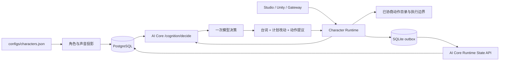

# 统一认知、身份与持久记忆

本文描述 `scripts/live-up.sh` 启动的本地主线。角色的人格、用户记忆、关系和情绪由 AI Core 的 `CognitionService` 组织；Character Runtime 负责日程、空间、事件调度和身体动作执行。Studio、Unity 和 Gateway 将输入交给同一个 Runtime。



一次认知请求使用 AI Core 的真实角色定义、记忆策略、关系状态和情绪状态，调用一次模型生成 `BehaviorDecision`。角色名、人格和背景来自投影；请求中的 persona 和传感器内容不能覆盖权威身份。模型提出的 `memory_update` 被清空，用户明确自述由服务按原话及现有记忆策略写入。自主事件可以静默，不因此生成用户事实或推进用户关系。动作仍须通过 Runtime 的已协商动作目录；模型不能直接发送执行器指令。

## 文件与身份

`configs/characters.json` 是本地主线的角色编辑来源。启动及角色热载将定义投影到已有 `brands`、`characters`、`voice_profiles` 表，并创建所需 `end_users` 行。投影保存源配置标记，提交后使角色和声音缓存失效。

同一品牌下的新角色 UUID 由 agent slug 确定性生成。已有投影优先按源标记找到；旧 Studio 创建的角色仅在同名且唯一、尚未被标记时采用其现有 UUID，保护已有外键关系。歧义同名会拒绝投影；改显示名称不会改变身份。当前同步是 upsert，文件移除角色不会自动删除数据库历史。

| 字段 | 含义与作用域 |
| --- | --- |
| `brand_id` | 服务端品牌上下文，参与角色投影和访问校验 |
| `user_id` | 用户/本地家庭身份；拥有与角色的关系及记忆 |
| `character_id` | 品牌下的持久角色 UUID |
| `agent_id` | 文件中的稳定角色 slug |
| `body_id` | 当前显示或执行身体，不划分长期记忆 |
| `session_id` | 请求与会话来源，不划分用户与角色的长期关系 |

本地一个 Runtime 实例只服务一个受信任的用户 scope：使用 `SOULFORGE_USER_ID`，缺省时从品牌生成稳定本地用户 UUID。外部 OpenAI 请求的 `user` 字段是标签，不能选择别人的记忆。多家庭或多租户部署仍需独立的用户认证与 Runtime 路由设计；本地主线不提供该产品能力。

Gateway 在统一模式下从 PostgreSQL 核对设备已有归属，旧 Redis 缓存中的空用户不能掩盖后来的真实绑定。开发环境首次连接的未知设备只自动注册到当前品牌、已投影的 Runtime 角色与已存在的安装用户；生产环境不自动注册未知设备。已有同品牌、未绑定用户的设备只在当前会话使用安装用户，不改设备行、不迁移旧记忆；其他用户或品牌的绑定直接拒绝（WebSocket 4003）。数据库无法核实归属时返回暂不可用（1013），不会把故障当成未注册设备而授予当前用户的记忆访问权。

内部接口使用服务 token 与品牌上下文。记忆读写进一步核对角色归属、已有用户与 agent 投影标记。共享身份入口在 `soulforge_harness/runtime/identity.py`。

## 恢复与 outbox

Runtime 的五层 KV 是 `profile`、`episodic`、`semantic`、`relational`、`compiled_behavior`。四个主要层使用既有记忆表；Runtime 的 `compiled_behavior` KV 暂存于 semantic 表，通过 `raw_source.runtime.layer` 区分，它不等于 AI Core 自动编译出的 `compiled_behavior_rules`。可读内容进入现有记忆检索路径，完整键值保留在 `raw_source`。

`/runtime/memory/recall` 按用户、角色、agent 和层读取全部键，不经过 RAG top-k 截断。稳定行 ID 使重试和同键更新幂等。角色间熟悉程度使用 relational 层的 `relationship:<agent>` 键。键长上限为 256 字符；profile 表实际使用 TEXT 列；单条编码内容上限为 64 KiB。

启动时先投影并 bootstrap 服务端快照，再按原顺序合并本地未确认写入；热载不会覆盖已加载角色的 pending 更新。正常 tick 不等待记忆 HTTP 请求：先提交 SQLite outbox，再更新本地视图，由单个后台线程按 FIFO 发送。网络失败保留队头并报告脱敏错误；服务端确认后才删除磁盘条目。`flush()` 用于关闭或检查点。

默认队列路径为 `outputs/runtime-memory/<brand>/<user>/outbox.sqlite3`，可由 `SOULFORGE_MEMORY_OUTBOX` 指定。路径不按身体或会话划分；文件校验品牌和用户所有权，权限为当前用户读写，不保存服务 token。此目录需要在重启间保留，每个用户 scope 应保持一个负责写入的 Runtime 进程。

服务端删除或 DENIED 规则优先于待写队列：recall 返回被阻止的键，bootstrap 不恢复这些键；写入得到明确的 `blocked` 结果后清理 MemoryStore 缓存与对应 outbox，不堵塞后续写入。身份/鉴权失败保留为失败状态，不作为删除确认。`health()` 暴露 `durable_outbox`、`pending_writes`、`writes_completed`、`writes_blocked` 和 `last_error`。当前没有服务端删除向正在运行的客户端主动推送的机制；MemoryStore 在下次 bootstrap 或相关键写入确认时同步权限，Runtime 已持有的其他视图没有即时全局失效保证。

长期事实和关系使用 PostgreSQL。短期对话历史与 PAD 仍走现有 Redis 缓存，不能将这些恢复能力理解为任意时刻完整对话、身体执行与日程进度的事务快照。原始事件表的 `observed_at` 是无时区 TIMESTAMP；写入边界将时间转换成 UTC 后编码，避免 asyncpg 的带时区时间类型错误。

## 验证边界

离线测试覆盖多用户隔离、旧角色 UUID 采用、角色/声音热载、完整键恢复、队列顺序、故障告警，以及子进程直接退出后的 SQLite 重放。已用本机真实 PostgreSQL 的随机测试品牌和用户验证五层 SQL、删除/禁止重试、最大 profile 键、原始事件、事实保存及跨身体检索；外层事务最后回滚。认知集成使用真实依赖工厂与服务，LLM、缓存和 embedding 使用受控测试设置，不涉及收费模型或真实记忆内容。

普通测试不依赖数据库；真实数据库检查须显式启用，并限制为本机连接：

```bash
.venv/bin/python -m pytest tests/test_runtime_persistent_store.py packages/ai-core/tests/test_runtime_state_projection.py packages/ai-core/tests/test_raw_event_log.py -q
RUN_POSTGRES_RUNTIME_INTEGRATION=1 .venv/bin/python -m pytest packages/ai-core/tests/test_runtime_postgres_integration.py -q
```

真实模型输出稳定性、音视频同步、身体动作效果与端到端延迟仍需独立 live 验收。启动配置和公共入口边界见 [live-stack.md](live-stack.md)，指标起点、缺失值和采样范围见 [latency.md](latency.md)。
